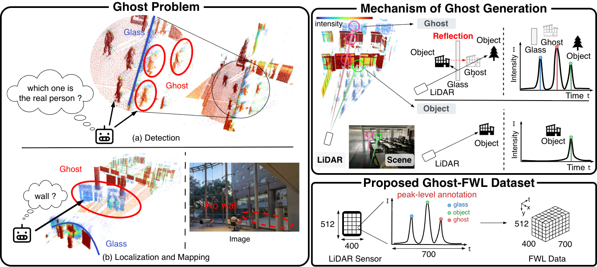

<div align="center">

# Ghost-FWL: A Large-Scale Full-Waveform LiDAR Dataset for Ghost Detection and Removal

[Kazuma Ikeda](https://github.com/ike-kazu)<sup>1*</sup> &emsp;
[Ryosei Hara](https://ryhara.github.io/)<sup>1*</sup> &emsp;

Rokuto Nagata<sup>1</sup> &emsp;
Ozora Sako<sup>1</sup> &emsp;
Zihao Ding<sup>1</sup> &emsp;
Takahiro Kado<sup>2</sup> &emsp;
Ibuki Fujioka<sup>2</sup> &emsp;
Taro Beppu<sup>2</sup> &emsp;

[Mariko Isogawa](https://isogawa.ics.keio.ac.jp/)<sup>1</sup> &emsp;
[Kentaro Yoshioka](https://sites.google.com/keio.jp/keio-csg/home)<sup>1</sup>


<sup>1</sup> Keio University <br>
<sup>2</sup> Sony Semiconductor Solution<br>
<sup>*</sup> Equal contribution<br>


<font color="red"><strong>CVPR 2026</strong></font>

<a href='https://keio-csg.github.io/Ghost-FWL/'></a>
<!-- <a href='#'></a> -->
</div>

<div align="center">



</div>

This is the official implementation of **[Ghost-FWL](https://keio-csg.github.io/Ghost-FWL/)**


## Installation
- requirements
    - install [uv](https://docs.astral.sh/uv/)
    - create [Weights and Biases](https://wandb.ai/) account
- clone the repositoryW
    ```bash
    git clone git@github.com:Keio-CSG/Ghost-FWL.git
    ```
- init (only after cloning the repository)
    ```bash
    uv sync

    # (optional)
    uv run pre-commit install
    uv run pre-commit autoupdate
    ```

## Dataset
See [README_dataset.md](docs/README_dataset.md) for more details.

## Pretrain
```bash
uv run python scripts/run_train.py --config configs/config_pretrain.yaml
```

## Train
```bash
uv run python scripts/run_train.py --config configs/config_train.yaml
```

## Estimate
```bash
uv run python scripts/run_estimate.py --config configs/config_estimate.yaml
```

## Test
### Test Recall
```bash
uv run python scripts/run_test.py --config configs/config_test.yaml
```
### Test Ghost Removal Rate
```bash
uv run python src/visualize/evaluate_pcd_batch.py --config src/visualize/configs/evaluate_pcd_batch.yaml
```

## Visualize
- `vis_pred.py`
  - visualize prediction results, ground truth annotations, and temporal histogram at peak locations (matplotlib)
```bash
uv run python src/visualize/vis_pred.py --config configs/config_test.yaml
```
- `vis_pcd.py`
  - save .pcd file from estimated results or ground truth annotations
```bash
uv run python src/visualize/vis_pcd.py --config src/visualize/configs/vis_pcd.yaml
```
- `vis_pcd_batch.py`
  - batch save .pcd file from estimated results or ground truth annotations
```bash
uv run python src/visualize/vis_pcd_batch.py --config src/visualize/configs/vis_pcd_batch.yaml
```

- `interactive_histogram_viewer.py`
  - visualize intensity map and histogram at the clicked location
```bash
uv run python src/visualize/interactive_histogram_viewer.py /path/to/voxel.b2 /path/to/{prediction,annotation}.b2
```

# Citation
```bibtex
@inproceedings{ikeda2026ghostfwl,
  title = {Ghost-FWL: A Large-Scale Full-Waveform LiDAR Dataset for Ghost Detection and Removal},
  author = {Ikeda, Kazuma and Hara, Ryosei and Nagata, Rokuto and Sako, Ozora and Ding, Zihao and Kado, Takahiro and Fujioka, Ibuki and Beppu, Taro and Isogawa, Mariko and Yoshioka, Kentaro},
  booktitle = {IEEE/CVF Conference on Computer Vision and Pattern Recognition (CVPR)},
  year = {2026},
}
```

# Code Reference
The primary references used for the implementation are listed below. Please refer to the original papers for all citations.
- [Lidar Waveforms are Worth 40x128x33 Words](https://light.princeton.edu/publication/lidar-transformers/)
- [MARMOT: Masked Autoencoder for Modeling Transient Imaging](https://arxiv.org/abs/2506.08470)
- [VideoMAE](https://github.com/MCG-NJU/VideoMAE)


# Contact
If you have any questions, please post an [issue](https://github.com/Keio-CSG/Ghost-FWL/issues) and mention @ike-kazu and @ryhara.
